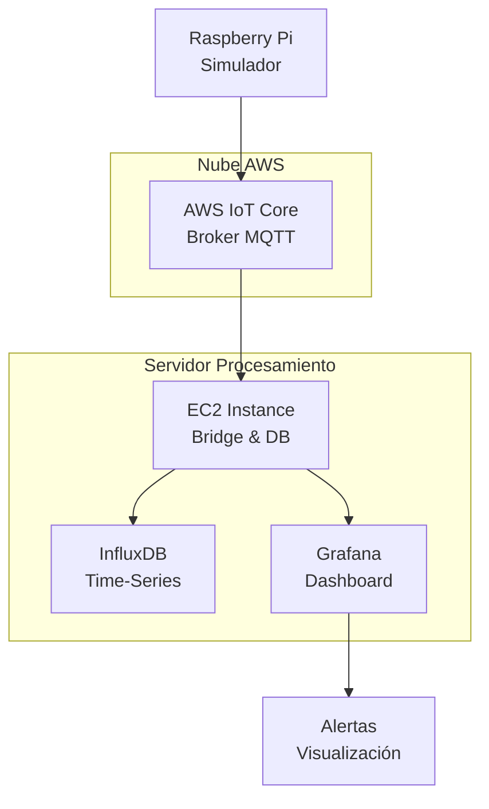

# ⚡ Contador Eléctrico Inteligente con Alertas

## 📋 Descripción
Sistema IoT para monitoreo inteligente de consumo eléctrico con detección de alertas en tiempo real. Simula un contador eléctrico que envía datos de consumo a la nube, los almacena y visualiza en dashboards interactivos.

## 🏗️ Arquitectura del Sistema


Sensor Simulado → MQTT/TLS → AWS IoT → Bridge Local → InfluxDB → Grafana
     ↓               ↓           ↓          ↓           ↓         ↓
  Generación      Transmisión  Broker    Forward    Almacenaje  Visualización
   de datos        Segura     Central    Local        TS       Tiempo Real


# ⚙️ Instalación y Configuración

## 1. Preparación Raspberry Pi
```
# Instalar dependencias
sudo apt update
sudo apt install mosquitto-clients python3-pip -y
pip3 install paho-mqtt

# Configurar certificados AWS IoT
mkdir /home/pi/certs
# Copiar: root-CA.crt, device-certificate.crt, private-key.key
```
## 2. Configuración AWS IoT Core
- Generar certificados (un-clic)

- Descargar y activar certificados

- Adjuntar política con permisos:

## 3. Servicios EC2
```
# Instalar servicios
sudo apt update && sudo apt upgrade -y
sudo apt install mosquitto mosquitto-clients -y

# InfluxDB v2
wget -q https://repos.influxdata.com/influxdata-archive.key
echo '23a1c8836f0afc5ed24e0486339d7cc8f6790b83886c4c96995b88a061c5bb5d influxdata-archive.key' | sha256sum -c && cat influxdata-archive.key | gpg --dearmor | sudo tee /etc/apt/trusted.gpg.d/influxdata-archive.gpg > /dev/null
echo 'deb [signed-by=/etc/apt/trusted.gpg.d/influxdata-archive.gpg] https://repos.influxdata.com/debian stable main' | sudo tee /etc/apt/sources.list.d/influxdata.list
sudo apt update
sudo apt install influxdb2 -y

# Grafana
sudo apt install -y software-properties-common
sudo add-apt-repository "deb https://packages.grafana.com/oss/deb stable main"
wget -q -O - https://packages.grafana.com/gpg.key | sudo apt-key add -
sudo apt update
sudo apt install grafana -y

# Iniciar servicios
sudo systemctl enable mosquitto influxdb grafana-server
sudo systemctl start mosquitto influxdb grafana-server

# Configurar InfluxDB
sudo influx setup
# Usar: admin/password123, org: SistemasProgramables, bucket: sensores
```


# 🚀 Uso del Sistema
## Inicio Completo del Sistema
```
# Terminal 1 - EC2: Bridge MQTT
python3 simple_bridge.py

# Terminal 2 - EC2: Conector a InfluxDB  
python3 mqtt_to_influx.py

# Terminal 3 - Raspberry: Simulador
python3 power_meter_simulator.py
```

## Scripts Principales

**1. power_meter_simulator.py**
```
# Características:
# - Simulación de patrones de consumo por horario
# - Detección de consumo alto continuo
# - Generación de picos aleatorios
# - Sistema de alertas configurable
# - Publicación MQTT cada 5 segundos

# Alertas implementadas:
# - CONSUMO_ALTO_CONTINUO
# - PICO_CONSUMO_CRITICO  
# - CONSUMO_CRITICO_URGENTE
```

**2. simple_bridge.py**
```
# Funcionalidades:
# - Conexión bidireccional AWS IoT ↔ Local
# - Reconexión automática
# - Soporte múltiples topics
# - Logging de actividad
```

**3. mqtt_to_influx.py**
```
# Características:
# - Procesamiento múltiples dispositivos
# - Campos dinámicos (temperature, power, alert, etc.)
# - Manejo de errores robusto
# - Escritura asíncrona a InfluxDB
```
# 📊 Configuración Grafana
### Datasource InfluxDB
- <b>Name</b>: InfluxDB-Sensors
- <b>URL</b>: http://localhost:8086
- <b>Organization</b>: SistemasProgramables
- <b>Token</b>: [Token de InfluxDB]
- <b>Bucket</b>: sensores

### ⚠️ Alertas 
```
from(bucket: "sensores")
  |> range(start: -1h)
  |> filter(fn: (r) => r._measurement == "power_alerts")
  |> filter(fn: (r) => r._field == "alert_type" or r._field == "power_level")
  |> pivot(rowKey:["_time"], columnKey: ["_field"], valueColumn: "_value")
  |> keep(columns: ["_time", "alert_type", "power_level", "device"])
```

# Lógica de Detección
1. Monitoreo Continuo:
- Lecturas cada 5 segundos

2. Umbrales Configurables:
```
ALERTAS = {
    "CONSUMO_ALTO_CONTINUO": "Consumo >2000W por más de 40 segundos",
    "PICO_CONSUMO_CRITICO": "Pico >4500W detectado", 
    "CONSUMO_CRITICO_URGENTE": "Consumo extremo prolongado"
}
```
3. Detección Patrones:
- Picos aleatorios (5-15% probabilidad)

4. Clasificación Alertas:
- Continuo: Patrón sostenido
- Pico: Evento puntual
- Crítico: Situación extrema


# 🔧 Personalización
## Ajuste Probabilidad Alertas
En power_meter_simulator.py:
```
# Probabilidad consumo alto (0.0 - 1.0)
if random.random() < 0.15:  # 15% probabilidad

# Probabilidad picos críticos  
if random.random() < 0.05:  # 5% probabilidad

# Umbral consumo alto continuo
if contador_alto > 8:  # 8 lecturas consecutivas
```

## Configuración Horarios Consumo
```
# Personalizar patrones horarios
if 0 <= hora < 6:    # Madrugada: 50-300W
elif 6 <= hora < 12: # Mañana: 200-800W  
elif 12 <= hora < 18: # Tarde: 500-1200W
else:                # Noche: 600-1800W
```
# 📈 Métricas y Monitoreo
### Datos Capturados
- Power: Consumo instantáneo (Watts)

- Voltage: Voltaje (120V simulado)

- Current: Corriente calculada (Amperios)

- Energy: Energía acumulada (kWh)

- Alerts: Eventos de alerta

# Verificación Flujo ✅
```
# 1. Raspberry envía datos
python3 power_meter_simulator.py
```

```
# 2. Bridge recibe
python3 simple_bridge.py
```

```
# 3. InfluxDB guarda
python3 mqtt_to_influx.py
```

```
# 4. Consulta datos
influx query 'from(bucket: "sensores") |> range(start: -5m)'
```

```
# 5. Grafana accesible
http://[IP-EC2]:3000
```


   
